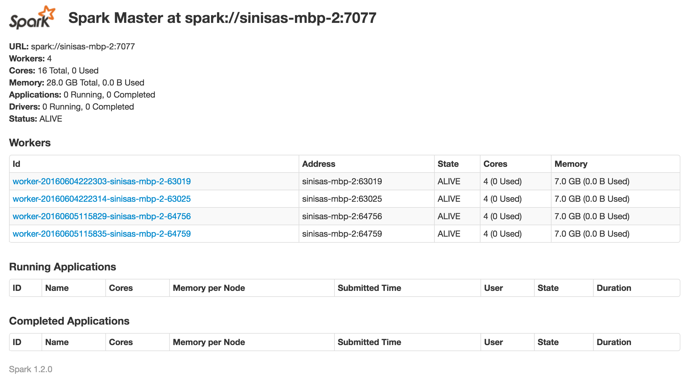

#Scala Spark Quick Guide#

Here’s a quick guide on setting up Spark with Scala.

##Setting up the project##

First of all, download [sbt](https://github.com/sbt/sbt). Now you can import the project into your favourite IDE:

####Eclipse####

Download [sbteclipse](https://github.com/typesafehub/sbteclipse). I would recommend getting sbt 0.13+ and adding the following to the global sbt file at *~/.sbt/plugins/plugins.sbt* (instead of editting the project-specific file): 

`addSbtPlugin("com.typesafe.sbteclipse" % "sbteclipse-plugin" % "2.5.0")`

Now create a folder which you will use for your Spark project and place the build.sbt found in this repo inside it. Then simply run sbt and use the *eclipse* command to turn it into an Eclipse project (I am assuming that you have Scala set up in your Eclipse IDE):

` > eclipse`

You can now simply import the created project as existing project into Eclipse workspace.

####IntelliJ####
If you're using IntelliJ then all you need to do is to import the project. Select File -> New -> Project from existing sources and import it as SBT project.

Note: You will need Scala 2.10 for these dependencies to work. At the time of writing this, Scala 2.11 was still not supported.

##Running the code without cluster##

Spark is meant to be run on clusters. However, to get you going you can simply run it on your local machine. Make sure to change spark master address to "local" in your Spark configuration:  

    val conf = new SparkConf().setAppName("sparkintro").setMaster("local")
    val sc = new SparkContext(conf)

Also remove the `% "provided"` part from the `build.sbt` if you want `sbt` to fetch the library for you. Later on, when we will have our own binary distribution of Spark needed to run master and slaves, we will need the "provided" part because we will want to run a JAR on Spark cluster (where Spark dependency is already available).

Code that performs the calculation in the `Main.scala` example is taken from an [official examples page](https://spark.apache.org/examples.html).

##Running the code on clusteer##
Of course, there's no fun in simply running it without a cluster (even if it's all run locally). We will now run Spark on a cluster of one master and four slaves. You will need a pre-built distribution of Spark for this; you can get it [here](http://spark.apache.org/downloads.html) (make sure to get the pre-built version). Unless you changed the build.sbt provided in this repo, version you need is 1.2.0.
  
Next step is to prepare the environment. You can use the template config file provided with the distribution:

    cp ./conf/spark-env.sh.template ./conf/spark-env.sh 
    echo "export SPARK_WORKER_INSTANCES=4" >> ./conf/spark-env.sh
  
Now that we have set up our environment to use four Spark workers, all that's left to do is to start the master and the slaves. Note that you will need an SSH deamon running on your system. Linux users can see if it's running by issuing:

    service ssh status
    
while for OS-X it's:

    launchctl list | grep ssh
    
If the service is not running, make sure to install it and run it. For Mac users it's probably enough to enable System Preferences -> Sharing -> Remote Login. Anyways, setting up the SSH deamon is not the point of this text, I'm sure you'll figure it out.

Once the SSH deamon is all good, we can run our master and slave scripts:

    ./sbin/start-master.sh
    ./sbin/start-slaves.sh
    
You will possibly be asked for the system password in order to be able to "SSH to yourself". 

OK, once that's done you can navigate to http://localhost:8080 to check out the state of your brand new Spark cluster. You should see something like:

##Running the app on cluster##

Alright. Now all we need to do is to package our app and feed it to running Spark cluster. 

In case you changed the master to point to `local` eariler, now is the good time to switch it to `.setMaster("[SPARK_ADDRESS]")` (you can see your `SPARK_ADDRESS` when you navigate to Spark console on http://localhost:8080; in my case it was `spark://sinisas-mbp-2:7077`, as can be seen in the screenshot. Also, if you removed the "provided" part in the `build.sbt`, now is the good time to bring it back.

You can now create the JAR of your application. Easiest way to do it is using [sbt-assembly](https://github.com/sbt/sbt-assembly). Basically all you need to do (and it's already done for you in this repo) is to add the `assembly.sbt` file with needed dependency to the `project` folder. All you need to do now is to run `sbt assembly` task and your shiny app will be created somewhere in `target` folder (if you didn't change anything, it should be something like `target/scala-2.10/sparkintro-assembly-1.0.jar`).

JUST ONE MORE STEP LEFT.

In the Spark binary directory, issue the following command to submit your shiny application to the Spark machinery:

    PATH-TO-SPARK/bin/spark-submit --class CLASSFILE PATH-TO-JAR
    
or, using default values from this repo:

    ./bin/spark-submit --class com.slouc.sparkintro.Main /path-to-shiny-app/target/scala-2.10/sparkintro-assembly-1.0.jar 

Keep an eye on that console on port 8080 if you want to be assured that your hard-working slaves are really doing the work.

And voila! You should see an aproximation of value of Pi somewhere in the console where you submitted the Spark job.

